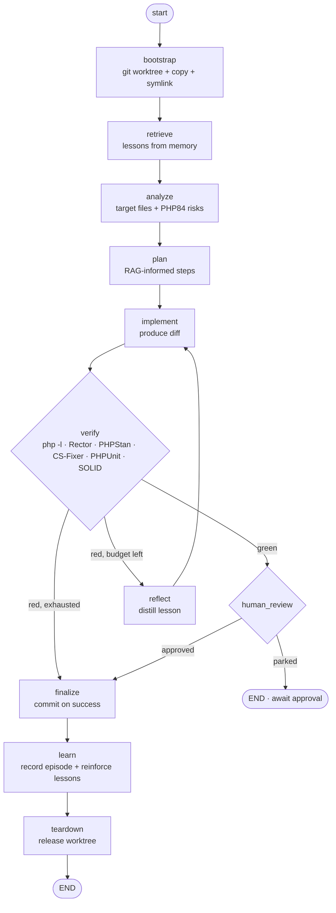

# Self-Learning Dev Orchestrator (Yii 1.1 → PHP 8.4)

A LangGraph pipeline that develops changes against a legacy **Yii 1.1** app while
targeting **PHP 8.4** and enforcing **SOLID**. It lives in
`workflows/dev_orchestrator/`, fully decoupled from the MVP graph in
`workflows/graph/` so neither breaks the other.

The design principle is the same as the rest of the repo: **the LLM is one node,
never the engine.** The graph is the engine; deterministic tools (git, Rector,
PHPStan, PHPUnit) decide correctness; the LLM only proposes.

## Pipeline



## Nodes

| Node | Responsibility | Deterministic? |
|------|----------------|----------------|
| `bootstrap` | `git worktree add` a task branch, copy per-task config files, symlink heavy shared dirs (`vendor/`, `runtime/`, …) | yes (tool) |
| `retrieve` | Pull relevant lessons/episodes from long-term memory (self-learning) | yes (tool) |
| `analyze` | Map goal → target files + PHP 8.4 migration risks | LLM |
| `plan` | Ordered migration + SOLID steps, RAG-informed | LLM |
| `implement` | Emit the change as a unified diff; bumps the loop counter | LLM |
| `verify` | Run the quality gates, aggregate a report | yes (tools) |
| `reflect` | Turn a failed gate into a persisted lesson, prime the retry (Reflexion) | LLM + tool |
| `human_review` | Pause for approval of the verified diff | — |
| `finalize` | Commit in the worktree on success, else report failure | yes (tool) |
| `learn` | Record the episode; reward lessons that led to green | yes (tool) |
| `teardown` | `git worktree remove` | yes (tool) |

## The bootstrap step (worktree + copy + symlink)

Requested explicitly: *"before starting a new task, make a git worktree, copy
files, set up symlinks, then begin development."* This is a **deterministic
tool**, not the LLM, because it is security-sensitive (symlinks, deletes). It is
driven by pure config:

- **copy** (per-task, mutable): `config/main-local.php`, `config/console-local.php`, `.env`
- **symlink** (shared, heavy/generated): `vendor/`, `runtime/`, `assets/`, `uploads/`

Worktrees isolate each task on its own branch/directory, so parallel runs never
collide, and `teardown` releases the worktree after the commit lands on the
branch.

## SOLID + PHP 8.4 enforcement

These are the checks the LLM is **not** trusted to eyeball. Yii 1.1 on PHP 8.4
has concrete pitfalls (`each()` removed, dynamic properties deprecated —
`#[AllowDynamicProperties]` on `CComponent` subclasses, `create_function`,
curly-brace string offsets, `CActiveRecord` magic accessors). Rector and PHPStan
catch these deterministically instead of the LLM guessing.

| Goal | Tool | Role |
|------|------|------|
| PHP 8.4 syntax/behavior | `php -l`, **Rector** (`PHP_84`) | auto-migrate + gate |
| Static type safety | **PHPStan** (Yii1 extension) | gate → feeds `reflect` |
| Style | **PHP-CS-Fixer** | auto-fix |
| Regressions | **PHPUnit** | gate |
| SOLID | LLM rubric + PHPStan rules (coupling, `final`, constructor DI) | review score |

## Self-learning

Two memory tiers (both destined for Postgres + `pgvector` in production):

1. **Episodic** — full run trajectories, embedded for similarity retrieval.
2. **Lesson / semantic** — distilled rules written by `reflect`/`learn`, e.g.
   *"Migrating a Yii1 model to PHP 8.4: add `#[AllowDynamicProperties]` or
   PHPStan level 5 fails on magic set."*

`retrieve` pulls these into planning (RAG); `reflect` writes new ones on failure
(**Reflexion**); `learn` **reinforces** lessons whose application led to a green
verify, so useful lessons rank higher over time. That is the self-improvement
loop — repeated error classes stop costing retries because the fix arrives in
the plan.

## Dependency injection (SOLID in the orchestrator itself)

Every side effect is a `Protocol` in `deps.py`, so tests inject Fakes and prod
injects real implementations without touching the graph:

| Interface | Fake (tests) | Real (prod) |
|-----------|--------------|-------------|
| `WorkspaceManager` | `FakeWorkspaceManager` | `GitWorktreeManager` |
| `PhpToolchain` | `FakePhpToolchain` | `SubprocessPhpToolchain` |
| `MemoryStore` | `InMemoryMemoryStore` | `PgVectorMemoryStore` *(stub)* |
| `DevLLM` | `FakeDevLLM` | `OllamaDevLLM` *(prompts TBD)* |

Build them with `factory.build_fake_deps()` / `factory.build_real_deps(config)`.

## Running

```python
from langgraph.checkpoint.memory import InMemorySaver
from workflows.dev_orchestrator.builder import build_dev_orchestrator_graph
from workflows.dev_orchestrator.config import DevOrchestratorConfig
from workflows.dev_orchestrator.factory import build_fake_deps
from workflows.dev_orchestrator.service import DevOrchestratorService

config = DevOrchestratorConfig(require_human_review=True)
graph = build_dev_orchestrator_graph(checkpointer=InMemorySaver(), deps=build_fake_deps(config))
service = DevOrchestratorService(graph=graph, config=config)

parked = service.start(goal="Migrate User model to PHP 8.4")   # runs to human_review
done = service.approve(parked["workflow_id"])                  # resumes to completion
```

Tests: `pytest tests/test_dev_orchestrator.py`.

## Scaffold status / next steps

Done (this commit): full graph, state, DI-ready deps, Fake implementations,
Reflexion loop, self-learning memory (in-memory), 8 tests.

To productionize:

1. Set `DevOrchestratorConfig.target_repo_path` to the legacy Yii 1.1 checkout.
2. Fill in `OllamaDevLLM` prompts per role.
3. Implement `PgVectorMemoryStore` (embedding column + `<->` retrieval).
4. Wire real Rector/PHPStan/PHPUnit config into the target repo's `vendor/bin`.
5. Persist workspaces/approvals via the existing `workflows.persistence` repos.
6. Add budget enforcement (reuse `Budget`/`BudgetUsed` from `workflows.models`).
